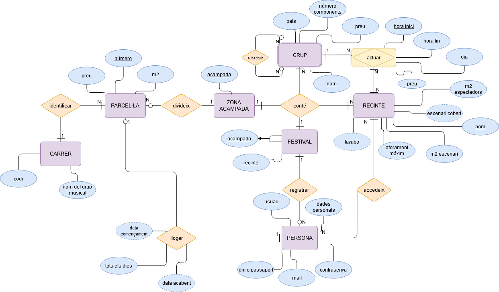

# disseny-DDBB

En este esquema de flujo tenemos una entidad principal que es FESTIVAL, de la cual derivan otras entidades con sus atributos, cardinalidades y relaciones.

## Festival
La entidad FESTIVAL cuenta con dos atributos principales: acampada y recinto. Su cardinalidad es de 1 y es obligatoria, ya que solo puede existir un festival, y su presencia es esencial para el sistema.
### ------------------------------------------------------------------------------------------
Las otras subentidades principales que están conectadas con FESTIVAL a través de una relación son ZONA DE ACAMPADA y RECINTE. 

## ZONA ACAMPADA
La entidad ZONA ACAMPADA está relacionada con PARCEL·LA. Esta entidad tiene como atributo acampada y su cardinalidad es de 1 y obligatoria, ya que cada festival debe tener una zona de acampada asignada.  

## RECINTE
La entidad RECINTE incluye varios atributos, de los cuales algunos son opcionales, como lavabo y escenario cubierto, ya que pueden no estar disponibles en todos los recintos. Los demás atributos son obligatorios. RECINTE se conecta con dos entidades, GRUP y PERSONA, con una cardinalidad de N y obligatoria en ambas direcciones. La relación asociativa con estas entidades implica que es N obligatorio para ambas partes.

## GRUP 
La entidad GRUP presenta una relación recursiva, ya que un grupo puede ser sustituido por otro. Esto se traduce en una recursividad de N opcional a N opcional. GRUP es considerada una entidad débil porque no tiene la suficiente fuerza para considerarse una entidad normal y está conectada a RECINTE. Tiene cuatro atributos, siendo su nombre la clave primaria. Al estar conectada a una relación asociativa, su cardinalidad es de 1 obligatorio a N obligatorio.

## RELACIÓN ASOCIATIVA: ACTUAR
La relación asociativa ACTUAR permite que la misma combinación de grupo y recinto pueda repetirse en diferentes fechas y horarios, lo que representa que un grupo puede actuar varias veces en el mismo o en diferentes recintos, en horarios distintos. La cardinalidad de esta relación es N obligatoria en ambas direcciones, asegurando la integridad de las actuaciones programadas.

## PARCEL·LA
La entidad PARCEL·LA está relacionada con CARRER y contiene atributos como número, extensión en metros cuadrados y el precio de alquiler. Cada parcela se identifica de manera única dentro de su calle, y puede haber parcelas con el mismo número en diferentes calles. La relación con CARRER es de N a 1, donde cada parcela pertenece a una sola calle.

## CARRER
La entidad CARRER se compone de atributos como código y nombre de un grupo musical famoso, que se utilizan para identificar cada calle en la zona de acampada. Cada calle puede tener múltiples parcelas, lo que se representa mediante una relación de 1 a N con PARCEL·LA.

## PERSONA
La entidad PERSONA representa a los asistentes al festival. Cada persona se identifica mediante un usuario, y se guardan atributos como contraseña, DNI o pasaporte, correo electrónico y datos personales. La relación con PARCEL·LA es de 1 a 1, ya que un responsable puede alquilar solo una parcela.

## Esquema de fluxe
